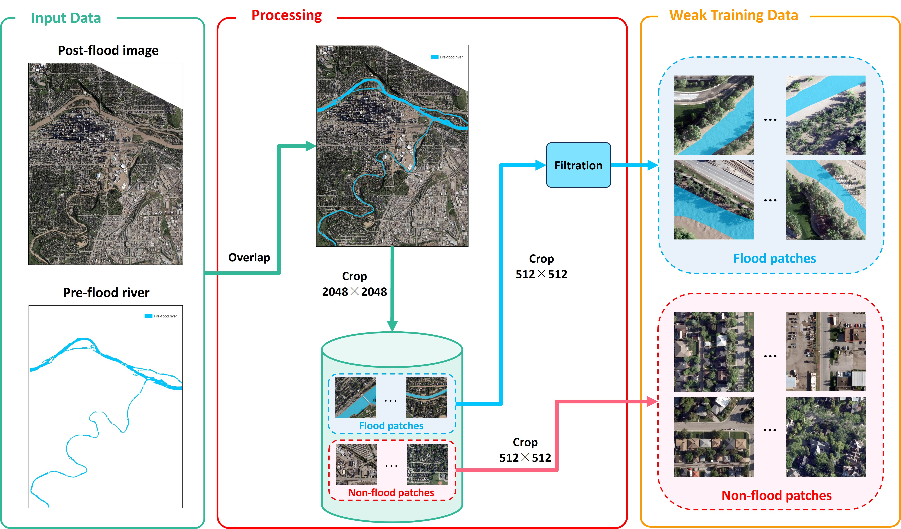
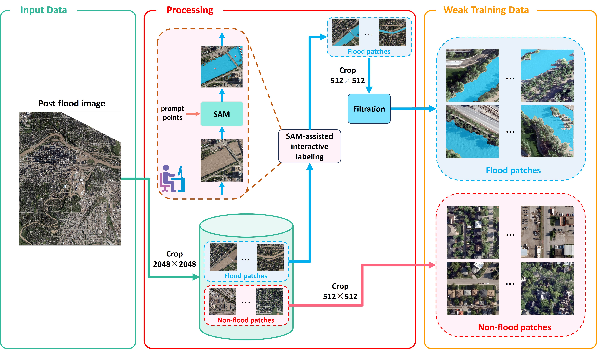
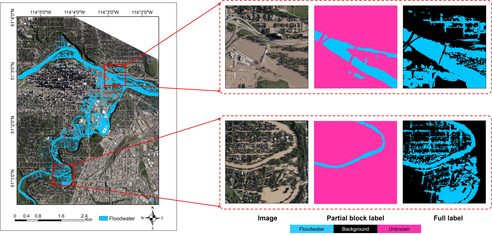
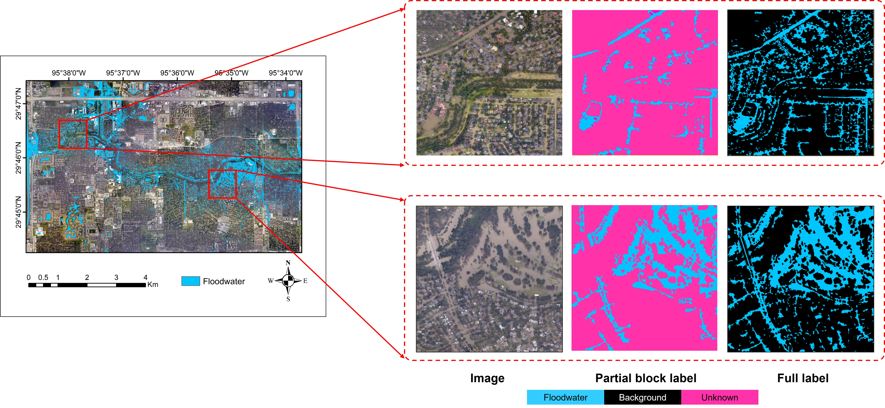

# An Efficient Urban Flood Mapping Framework Towards Disaster Response Driven by Weakly Supervised Semantic Segmentation with Decoupled Training Samples

## Introduction

This is the official PyTorch implementation of paper: [An Efficient Urban Flood Mapping Framework Towards Disaster Response Driven by Weakly Supervised Semantic Segmentation with Decoupled Training Samples](https://www.sciencedirect.com/science/article/pii/S0924271623003465), which propopsed a novel weakly supervised semantic segmentation framework and an efficient weak training data generation approach for rapid flood mapping from high-resolution aerial imagery in urban areas.

### Weak training data generation 
- Weak data from pre-flood river
- Weak data from SAM (Segment Anything Model)

### Weakly supervised semantic segmentation framework (TFCSD)
## Datasets

The datasets used in this paper can be accessed from [[GoogleDirve]](https://drive.google.com/drive/folders/1pNIfaiHdzeL5-hA0sp8ms4wJTCBiRgLz?usp=sharing) or [[BaiduDisk]](https://pan.baidu.com/s/1GfWQIq3J_XVd0MWLhdKVOA?pwd=r5wa).

| **Dataset** | **Fully Labeled Data** | **Flood Patches** | **Non-Flood Patches** | **Spatial Resolution(m)** | **Patch Size** | **Band** | **Platform** |
| --- | --- | --- | --- | --- | --- | --- | --- |
| Calgary-Flood | 2862 | 254 | 800 | 0.2 | 512 × 512 | RGB | Airplane |
| Huston-Flood | 2560 | 305 | 800 | 0.3 | 512 × 512 | RGB | Airplane |

Calgary-Flood dataset
Huston-Flood dataset

## Directory Structure

To utilize the code, need to first generate lists of image/label files and place as the structure shown below. Every txt file contains the full absolute path of the files (each file per line). For your convenience, we provide exampled list files of training project for weakly supervised learning in the related datasets [[GoogleDirve]](https://drive.google.com/drive/folders/1pNIfaiHdzeL5-hA0sp8ms4wJTCBiRgLz?usp=sharing) or [[BaiduDisk]](https://pan.baidu.com/s/1GfWQIq3J_XVd0MWLhdKVOA?pwd=r5wa). The image file is the RGB-band image and the label file is the 256-bit image with value from 0 to 255 (0: non-flood pixel, 1:food pixel, 255: unknown pixel).
```
/root
    /train_image.txt       # the list of training images with absolute path 
    /train_label.txt       # the list of training labels with absolute path
    /test_image.txt        # the list of testing images with absolute path
    /test_label.txt        # the list of testing labels with absolute path
    /val_image.txt         # the list of validation images with absolute path
    /val_label.txt         # the list of validation labels with absolute path
```

## Code

### Requirements

- The code is developed using Python 3.7 with PyTorch 1.9.1.
- Anaconda is used to manage the environment and package.

### Installation

- `git clone https://github.com/YJ-He/Flood_Mapping_WSSS`
- `cd Flood_Mapping_WSSS`
- `conda env create -f environment.yaml`
- `conda activate flood_mapping_wsss`
- `cd utils/lib_tree_filter` then, `python setup.py build develop`

### Training

- set `root_dir` and hyper-parameters configuration in `./configs/config_WSL.cfg`.
- run `python train_WSL.py`.

### Evaludation

- set `root_dir` and hyper-parameters configuration in `./configs/config_WSL.cfg`.
- set `pathCkpt` in `test_WSL.py` to indicate the model checkpoint file.
- run `python test_WSL.py`.

## Acknowledgment

- Natural Resources Canada
- City of Calgary
- National Oceanic and Atmospheric Administration (NOAA)
- Megvii Research
  

## Citation

If this repo is useful in your research, please kindly consider citing our paper as follow.

```
@article{he2024efficient,
  title={An efficient urban flood mapping framework towards disaster response driven by weakly supervised semantic segmentation with decoupled training samples},
  author={He, Yongjun and Wang, Jinfei and Zhang, Ying and Liao, Chunhua},
  journal={ISPRS Journal of Photogrammetry and Remote Sensing},
  volume={207},
  pages={338--358},
  year={2024},
  publisher={Elsevier}
}
```

**If our work give you some insights and hints, star me please! Thank you~**
